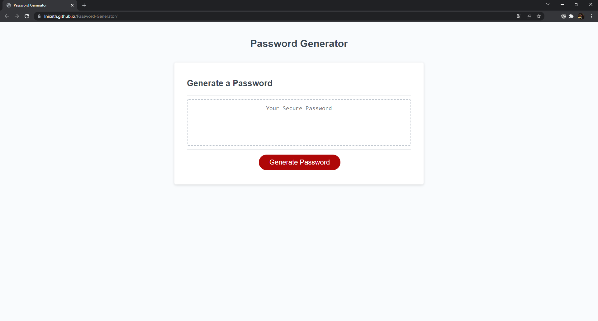

# Password Generator

```

## Discription


Passwords generator is a web application that generates a password between 8 and 128 characters based on certain requirements chosen by the user. It also has an option for copying the password to the clipboard.


## Deployment

To deploy this project run

```bash
  https://lniceth.github.io/Password-Generator/
```


### Screenshots


